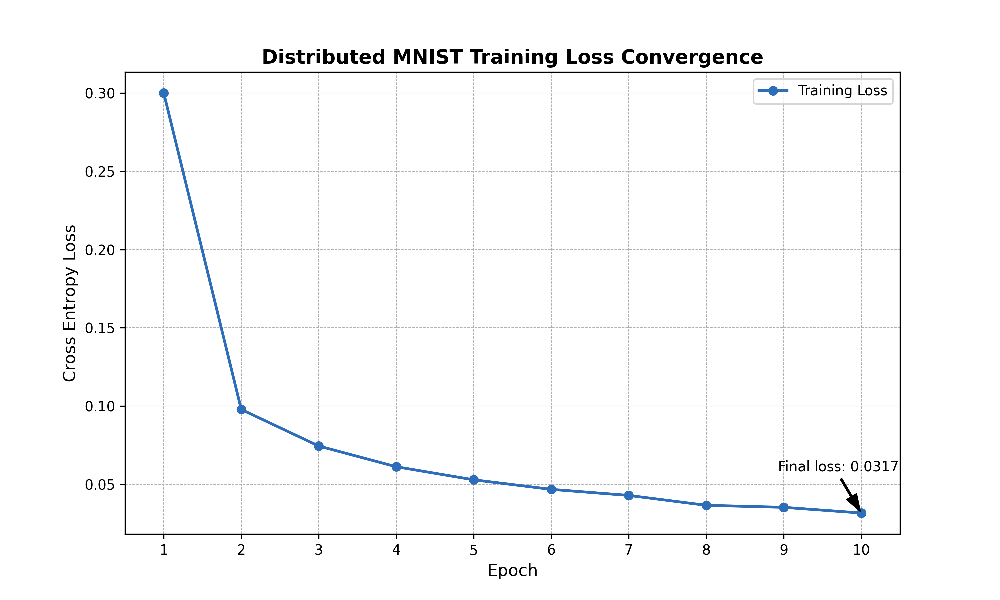

# Distributed MNIST Training using Ray's PyTorch integration on a cluster
**Note on source code:** This project was developed as part of a university coursework requirement. To comply with academic integrity policies regarding solution distribution, the full source is in a private repo. Access can be granted upon request.

### **Features:**
* **Zero Distributed Storage Requirements:** Bypasses I/O bottlenecks and shared storage overhead by utilizing local tempfiles ('/tmp') for model checkpoints and internal communication.
* **Synchronized Gradients:** Implements distributed data parallelization (DDP) by wrapping the model training function with 'ray.train.torch' utilities.
* **Deterministic Result Aggregation:** Solves distributed race conditions that cause data misalignment by implementing a Pass-Through label strategy in the inference loop.
* **Distributed Inference:** Decouples training from inference using 'map_batches' to parallelize predictions across the cluster, reducing prediction time inversely to the size of the cluster.
* **Data Shuffling:** Shuffles each batch individually to ensure that the model does not get stuck in local minima across epochs.

### **Performance Metrics**
The model achieves convergence within 10 epochs, showing stable gradient descent. 

* **Final Testing Accuracy:** '>98%'
* **Final Training Loss:** '<0.04'

*Generated via aggregation of distributed metrics*

### **System Architecture**

* **Orchestration: Ray Core,** Manages worker telemetry and resource allocation.
* **Training: Pytorch DDP,** Handles gradient synchronization via MapReduce.
* **Data Sharding: Ray Data,** Shards data to ensure speed and full dataset coverage.
* **Persistence: Local tempfiles,** Weights are saved locally to ensure integrity, head node aggregates.

### **The Keystone**
Instead of training separate models on each node, which leads to divergence and sub-optimal gradient descent, the gradient is communicated to the head node, averaged, and applied to all workers before each backward pass. Synchronization is ensured by wrapping the training function with 'ray.train.torch.prepare_model()'.

### **How-to**
* **Dependencies:** Ray, Torch, Pandas, NumPy, Matplotlib for graphing
* **Requirements:** Ray cluster,  placed in the same folder on the head node as the driver script.
* **Setup:** Open the script in editor, and enter the number of worker nodes to utilize in the *WORKERS* macro near the top.
* **Running:** Simply navigate to the directory containing the driver and data, and run using **python MNIST_pytorch_ray.py** in the terminal.
* **For loss chart:** Run **losschart.py** in the same folder as MNIST_metrics.csv (will appear in same folder as script after running.)

### **Files**
* MNIST_pytorch_ray.py
* losschart.py
* loss_convergence_plot_ex.png
